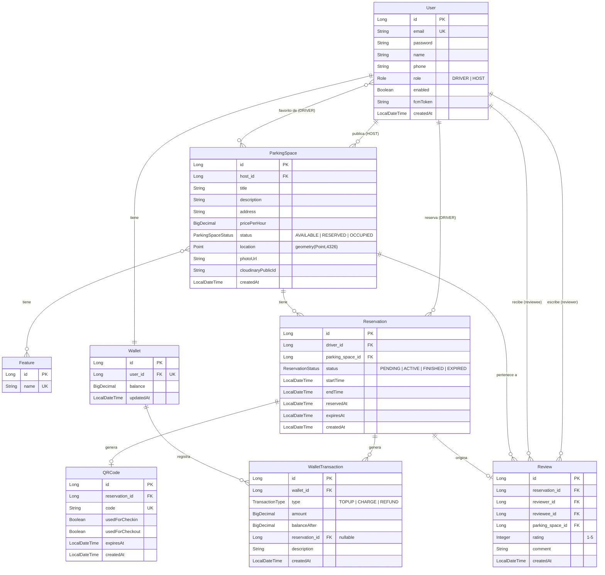

# 🅿️ ParkShare — Marketplace Inteligente de Estacionamiento On-Demand en Lima Metropolitana

---

## 📑 Portada

* **Proyecto:** ParkShare — Plataforma Backend de Estacionamiento On-Demand
* **Curso:** CS 2031 Desarrollo Basado en Plataforma
* **Institución:** Universidad de Ingeniería y Tecnología (UTEC) — Lima, Perú
* **Desarrollador / Integrante:** 
  * Christian Mar (christian.mar@utec.edu.pe)

---

## 🗂️ Índice

1. [Portada](#-portada)
2. [Índice](#%EF%B8%8F-%C3%ADndice)
3. [Introducción](#-introducción)
   * [Contexto](#contexto)
   * [Objetivos del Proyecto](#objetivos-del-proyecto)
4. [Identificación del Problema o Necesidad](#-identificación-del-problema-o-necesidad)
   * [Descripción del Problema](#descripción-del-problema)
   * [Justificación](#justificación)
5. [Descripción de la Solución](#-descripción-de-la-solución)
   * [Funcionalidades Implementadas](#funcionalidades-implementadas)
   * [Tecnologías Utilizadas](#tecnologías-utilizadas)
   * [Arquitectura del Sistema](#arquitectura-del-sistema)
6. [Modelo de Entidades](#-modelo-de-entidades)
   * [Diagrama Entidad-Relación](#diagrama-entidad-relación)
   * [Descripción de Entidades](#descripción-de-entidades)
7. [Testing y Manejo de Errores](#-testing-y-manejo-de-errores)
   * [Niveles de Testing Realizados](#niveles-de-testing-realizados)
   * [Resultados Obtenidos](#resultados-obtenidos)
   * [Manejo Centralizado de Errores](#manejo-centralizado-de-errores)
8. [Medidas de Seguridad Implementadas](#-medidas-de-seguridad-implementadas)
   * [Seguridad de Datos](#seguridad-de-datos)
   * [Prevención de Vulnerabilidades](#prevención-de-vulnerabilidades)
9. [Eventos y Asincronía](#-eventos-y-asincronía)
   * [Eventos de Spring Utilizados](#eventos-de-spring-utilizados)
   * [Necesidad y Asincronía en el Sistema](#necesidad-y-asincronía-en-el-sistema)
10. [GitHub & Management](#-github--management)
    * [GitHub Projects & Issues](#github-projects--issues)
    * [Pipeline de CI/CD con GitHub Actions](#pipeline-de-cicd-con-github-actions)
11. [Conclusión](#-conclusión)
    * [Logros del Proyecto](#logros-del-proyecto)
    * [Aprendizajes Clave](#aprendizajes-clave)
    * [Trabajo Futuro](#trabajo-futuro)
12. [Apéndices](#-apéndices)
    * [Licencia del Proyecto](#licencia-del-proyecto)
    * [Referencias Bibliográficas](#referencias-bibliográficas)
13. [Guía Técnica de Ejecución](#-guía-técnica-de-ejecución)
    * [Requisitos Previos](#requisitos-previos)
    * [Cómo Ejecutar con Docker Compose](#cómo-ejecutar-con-docker-compose)
    * [Variables de Entorno](#variables-de-entorno)
    * [Despliegue en la Nube](#despliegue-en-la-nube)
14. [Detalle de Endpoints de la API](#-detalle-de-endpoints-de-la-api)
15. [Hojas de Ruta: Flujo de Uso Correcto](#-hojas-de-ruta-flujo-de-uso-correcto)

---

## 📝 Introducción

### Contexto
El crecimiento vehicular en Lima Metropolitana ha superado con creces la capacidad de su infraestructura urbana. En distritos financieros y comerciales de alta afluencia como Miraflores, San Isidro y el Centro de Lima, encontrar un espacio seguro donde estacionar se ha convertido en una tarea compleja y estresante. Un conductor promedio en estas zonas pierde entre **20 y 30 minutos** circulando en círculos para encontrar estacionamiento, lo que agrava la congestión del tráfico, incrementa la contaminación por emisiones de carbono y eleva los niveles de estrés de la población.

### Objetivos del Proyecto
* **Objetivo General:** Desarrollar una plataforma backend escalable y segura bajo el paradigma de desarrollo basado en plataforma para mitigar el déficit de estacionamiento mediante la economía colaborativa.
* **Objetivo Específico 1 (Geolocalización):** Permitir la búsqueda y localización de cocheras disponibles en tiempo real en un radio menor a 2000 metros con un tiempo de respuesta de base de datos inferior a 150ms mediante índices geoespaciales.
* **Objetivo Específico 2 (Concurrencia):** Garantizar la consistencia transaccional y evitar colisiones de reservas dobles bajo alta concurrencia mediante bloqueos pesimistas en la base de datos PostgreSQL.
* **Objetivo Específico 3 (Financiero):** Implementar un módulo transaccional auditado al 100% que actualice de forma atómica los balances de billetera al completarse un check-out físico.

---

## 🔍 Identificación del Problema o Necesidad

### Descripción del Problema
El problema central es la ineficiencia en la distribución y el uso de los espacios de estacionamiento disponibles en Lima. Mientras que las calles públicas sufren por saturación y el estacionamiento informal cobra tarifas arbitrarias sin ofrecer seguridad, existen miles de cocheras privadas dentro de condominios, casas y locales comerciales que permanecen vacías durante gran parte del día (por ejemplo, cuando sus dueños salen a trabajar). No existe un canal digital eficiente que conecte esta oferta latente con la demanda en tiempo real.

### Justificación
La solución de este problema mediante **ParkShare** genera múltiples impactos positivos:
1. **Movilidad Urbana:** Reduce el tráfico circulante innecesario, permitiendo a los conductores dirigirse directamente a un estacionamiento reservado.
2. **Impacto Ambiental:** Al disminuir el tiempo de búsqueda, se reduce el consumo de combustible y la emisión de gases de efecto invernadero.
3. **Desarrollo Económico:** Ofrece a los propietarios de inmuebles (Hosts) una fuente de ingresos extra a través de la monetización de un recurso ocioso.
4. **Seguridad Ciudadana:** Retira los vehículos de la vía pública y del control de cobradores informales, ubicándolos en espacios privados vigilados.

---

## 💡 Descripción de la Solución

### Funcionalidades Implementadas
ParkShare es un marketplace de emparejamiento bajo demanda estructurado en microservicios y APIs REST:
* **Autenticación Basada en Roles:** Separación entre conductores (`DRIVER`) y anfitriones (`HOST`) con tokens de seguridad JWT stateless.
* **Búsqueda Geoespacial con PostGIS:** Consultas de distancia espacial utilizando coordenadas GPS en formato Point (SRID 4326) con cálculos en metros reales de la Tierra.
* **Sistema de Reservas con Timeout:** Las reservas se inician en estado `PENDING` y tienen una vigencia estricta de 15 minutos. Si el conductor no realiza el check-in a tiempo, un programador de tareas (`@Scheduled`) libera automáticamente la cochera.
* **Check-in y Check-out por QR:** Códigos QR generados con la librería ZXing asociados a UUIDs únicos en la base de datos. Permiten registrar el ingreso y salida del vehículo.
* **Billetera Virtual con Transacciones Auditadas:** Un monedero digital donde el conductor recarga saldo (`TOPUP`) y sobre el cual se realiza un cobro (`CHARGE`) proporcional al tiempo de uso real al marcar la salida.
* **Notificaciones Push y WebSocket:** Envío de notificaciones a través de Firebase Cloud Messaging al expirar reservas, y actualizaciones instantáneas de disponibilidad de cocheras mediante WebSockets a la ruta `/topic/parking-updates`.

### Tecnologías Utilizadas
* **Backend:** Java 21 y Spring Boot 3.2.5.
* **Base de Datos:** PostgreSQL 16 junto con la extensión espacial PostGIS 3.4 en Docker.
* **Seguridad:** Spring Security y JJWT 0.11.5 para cifrado y validación stateless.
* **Generación QR:** Google ZXing (Core & JavaSE) 3.5.2.
* **Almacenamiento de Imágenes:** Cloudinary SDK 1.36.0 para gestión remota de fotos de cocheras.
* **Mensajería y Notificaciones:** JavaMailSender con Thymeleaf para emails y Firebase Admin SDK 9.2.0.
* **Contenedores y Pruebas:** Docker + Docker Compose y TestContainers 1.19.7 para persistencia real en base de datos PostgreSQL durante los tests.

### Arquitectura del Sistema
El backend de ParkShare sigue una arquitectura limpia y desacoplada en capas (Controller-Service-Repository), integrada con bases de datos geoespaciales y diversos servicios externos asíncronos y en la nube.

A continuación se presenta el diagrama de arquitectura del sistema:

```mermaid
graph TD
    %% Estilos de los nodos (con fondo oscuro y texto blanco para legibilidad universal en temas claro/oscuro)
    classDef client fill:#2d3748,stroke:#4a5568,stroke-width:2px,color:#ffffff;
    classDef controller fill:#1a365d,stroke:#2b6cb0,stroke-width:2px,color:#ffffff;
    classDef service fill:#1c4532,stroke:#2f855a,stroke-width:2px,color:#ffffff;
    classDef repository fill:#44337a,stroke:#553c9a,stroke-width:2px,color:#ffffff;
    classDef external fill:#7b341e,stroke:#c05621,stroke-width:2px,color:#ffffff;
    classDef db fill:#234e52,stroke:#319795,stroke-width:2px,color:#ffffff;

    %% Nodos de Cliente
    subgraph Clientes ["Capa de Cliente / Presentación"]
        Postman["Postman / API Clients"]:::client
        WebClient["Aplicación Mobile / Web Browser"]:::client
    end

    %% Capa de Seguridad y Controladores
    subgraph CapaAPI ["Capa de Entrada & Seguridad"]
        JwtFilter["JwtAuthenticationFilter"]:::controller
        SpringSecurity["Spring Security Config"]:::controller
        AuthController["AuthController"]:::controller
        ParkingSpaceController["ParkingSpaceController"]:::controller
        ReservationController["ReservationController"]:::controller
        WalletController["WalletController"]:::controller
        CheckInOutController["CheckInOutController"]:::controller
        ReviewController["ReviewController"]:::controller
        WebSocketHandler["WebSocket / STOMP Updates"]:::controller
    end

    %% Capa de Negocio
    subgraph CapaNegocio ["Capa de Servicios (Lógica de Negocio)"]
        AuthService["AuthService"]:::service
        ParkingSpaceService["ParkingSpaceService"]:::service
        ReservationService["ReservationService"]:::service
        WalletService["WalletService"]:::service
        CheckInOutService["CheckInOutService"]:::service
        ReviewService["ReviewService"]:::service
        EmailService["EmailService (Async)"]:::service
        FCMService["FirebaseNotificationService (Async)"]:::service
        Scheduler["ReservationScheduler (Scheduled)"]:::service
    end

    %% Capa de Datos
    subgraph CapaDatos ["Capa de Repositorios (Persistencia)"]
        UserRepository["UserRepository"]:::repository
        ParkingSpaceRepository["ParkingSpaceRepository"]:::repository
        ReservationRepository["ReservationRepository"]:::repository
        WalletRepository["WalletRepository"]:::repository
        WalletTransactionRepository["WalletTransactionRepository"]:::repository
        QRCodeRepository["QRCodeRepository"]:::repository
        ReviewRepository["ReviewRepository"]:::repository
    end

    %% Infraestructura y Terceros
    subgraph CapaInfra ["Infraestructura & Servicios Externos"]
        PostgreSQL[("PostgreSQL + PostGIS Database")]:::db
        Cloudinary["Cloudinary (Image Storage)"]:::external
        Firebase["Firebase (Push Notifications)"]:::external
        SMTP["Gmail SMTP (Email Server)"]:::external
    end

    %% Flujos de Seguridad y Solicitudes
    Postman -->|Peticiones HTTP REST| JwtFilter
    WebClient -->|Peticiones HTTP / WebSockets| JwtFilter
    JwtFilter --> SpringSecurity
    SpringSecurity --> AuthController
    SpringSecurity --> ParkingSpaceController
    SpringSecurity --> ReservationController
    SpringSecurity --> WalletController
    SpringSecurity --> CheckInOutController
    SpringSecurity --> ReviewController
    SpringSecurity --> WebSocketHandler

    %% Flujos Controladores -> Servicios
    AuthController --> AuthService
    ParkingSpaceController --> ParkingSpaceService
    ReservationController --> ReservationService
    WalletController --> WalletService
    CheckInOutController --> CheckInOutService
    ReviewController --> ReviewService
    WebSocketHandler --> ParkingSpaceService

    %% Relaciones Lógicas entre Servicios
    AuthService --> UserRepository
    AuthService --> WalletService
    
    ParkingSpaceService --> ParkingSpaceRepository
    ParkingSpaceService --> Cloudinary
    
    ReservationService --> ReservationRepository
    ReservationService --> ParkingSpaceRepository
    ReservationService --> UserRepository
    
    WalletService --> WalletRepository
    WalletService --> WalletTransactionRepository
    
    CheckInOutService --> QRCodeRepository
    CheckInOutService --> ReservationRepository
    CheckInOutService --> WalletService
    CheckInOutService --> EmailService
    CheckInOutService --> FCMService
    
    ReviewService --> ReviewRepository
    ReviewService --> ReservationRepository
    ReviewService --> UserRepository

    Scheduler --> ReservationService
    Scheduler --> FCMService

    %% Flujos Repositorios -> Base de Datos
    UserRepository --> PostgreSQL
    ParkingSpaceRepository --> PostgreSQL
    ReservationRepository --> PostgreSQL
    WalletRepository --> PostgreSQL
    WalletTransactionRepository --> PostgreSQL
    QRCodeRepository --> PostgreSQL
    ReviewRepository --> PostgreSQL

    %% Flujos a Servicios Externos
    EmailService --> SMTP
    FCMService --> Firebase
```



---

## 📐 Modelo de Entidades

### Diagrama Entidad-Relación
El siguiente diagrama detalla la base de datos relacional de ParkShare:



### Descripción de Entidades
1. **User:** Representa a los usuarios del sistema. Posee credenciales, rol (`DRIVER` o `HOST`) y token de Firebase (`fcmToken`) para alertas.
2. **ParkingSpace:** Registra la cochera ofertada. Almacena la geolocalización física como un objeto espacial `Point` con coordenadas GPS e índices espaciales, y su estado de disponibilidad (`AVAILABLE`, `RESERVED`, `OCCUPIED`).
3. **Feature:** Atributos adicionales de comodidad o infraestructura de las cocheras (por ejemplo: "Techado", "Vigilancia 24/7").
4. **Reservation:** Almacena el ciclo de vida del alquiler de un espacio desde que se pre-reserva (`PENDING`) hasta que se factura y libera (`FINISHED`).
5. **Wallet:** Registra el saldo acumulado en BigDecimal (`precision 10, scale 2`) asociado a un único usuario de manera atómica.
6. **WalletTransaction:** Historial inmutable para fines de auditoría financiera. Guarda el saldo resultante posterior a la transacción (`balanceAfter`) para evitar discordancias.
7. **QRCode:** Vincula una reserva física con un identificador único tipo UUID. Permite al mismo código QR físico servir tanto para la entrada (`usedForCheckin`) como para la salida (`usedForCheckout`).
8. **Review:** Puntuación bidireccional que evalúa la calidad del servicio de la cochera tras culminar el alquiler.

---

## 🧪 Testing y Manejo de Errores

### Niveles de Testing Realizados
Para garantizar la calidad de software y cero regresiones bajo refactorizaciones críticas, el proyecto incluye una suite de pruebas automatizadas:
* **Pruebas de Repositorio (`@DataJpaTest`):** Hacen uso de **TestContainers** para levantar una base de datos Dockerizada real con la imagen `postgis/postgis:16-3.4-alpine`. Esto permite comprobar que las consultas espaciales complejas (ST_DWithin) se comporten de forma idéntica a producción.
* **Pruebas de Servicio (`Mockito`):** Mockean el acceso a la base de datos y validan las reglas de negocio (ej. validaciones de saldo de billetera, bloqueos, flujo de expiración de reservas, etc.).
* **Pruebas de Controlador (`@WebMvcTest`):** Validan la deserialización de payloads JSON, los códigos de estado HTTP (200, 201, 400, 401, 409) y el flujo de los filtros de Spring Security.

### Resultados Obtenidos
Las pruebas cubren escenarios de éxito y manejo de casos extremos (búsquedas sin resultados, cobros con saldo insuficiente, generación de códigos duplicados). Los errores identificados durante el desarrollo, como la sincronía de bloqueos concurrentes y los formateos de excepciones de tipo JSON, fueron solucionados y validados en verde.

### Manejo Centralizado de Errores
El proyecto implementa un manejador global con `@RestControllerAdvice` denominado `GlobalExceptionHandler`. Este intercepta todas las excepciones del sistema y las formatea de manera estándar en un DTO `ErrorResponse`, garantizando que el cliente reciba un JSON legible en español:
* `ResourceNotFoundException` -> Retorna `404 NOT FOUND` si una entidad no existe.
* `DuplicateResourceException` -> Retorna `409 CONFLICT` al registrar correos existentes.
* `InsufficientBalanceException` -> Retorna `400 BAD REQUEST` si el conductor no tiene saldo suficiente al salir.
* El manejo centralizado oculta trazas de error internas del servidor (Stack Traces), previniendo la fuga de información sensible.

---

## 🔒 Medidas de Seguridad Implementadas

### Seguridad de Datos
* **Cifrado de Contraseñas:** Se utiliza la clase `BCryptPasswordEncoder` para aplicar un algoritmo de hashing con salting automático a las contraseñas de los usuarios antes de persistirlas en la base de datos.
* **Seguridad de Tokens JWT:** Los tokens de autenticación se firman digitalmente utilizando algoritmos seguros con claves secretas de 256 bits extraídas de variables de entorno, impidiendo su falsificación.

### Prevención de Vulnerabilidades
* **Protección CSRF Deshabilitada de Forma Segura:** Dado que la API es estrictamente stateless y la autenticación se realiza mediante tokens JWT en las cabeceras HTTP `Authorization: Bearer`, el sistema está inherentemente protegido contra ataques Cross-Site Request Forgery (CSRF).
* **CORS Configurado:** Permite peticiones únicamente desde orígenes de desarrollo de confianza (`http://localhost:3000` y `http://localhost:5173`).
* **Validación de Entradas:** Uso de anotaciones de Jakarta Validation (`@Valid`, `@NotBlank`, `@Size`, `@Min`) para filtrar entradas maliciosas y datos corruptos antes de procesar cualquier transacción en el sistema.

---

## 🔄 Eventos y Asincronía

### Eventos de Spring Utilizados
* **`UserRegisteredEvent`:** Disparado al registrarse un usuario. Desencadena el envío de un correo de bienvenida.
* **`ReservationCompletedEvent`:** Publicado tras procesarse el check-out de manera correcta. Envía al conductor el comprobante detallado del alquiler por correo.
* **`ReservationExpiredEvent`:** Disparado de manera asíncrona cuando el timeout de reserva finaliza, con el fin de liberar recursos asociados a la cochera.

### Necesidad y Asincronía en el Sistema
El envío de correos (vía SMTP con plantillas de Thymeleaf) e interactuar con Firebase Cloud Messaging son operaciones de red bloqueantes que toman de 1 a 3 segundos. Si estas llamadas se realizaran dentro del hilo principal de la petición REST, degradarían significativamente la experiencia del usuario final, elevando el tiempo de respuesta de los endpoints.

Al habilitar `@EnableAsync` y configurar un pool de hilos personalizado en `AsyncConfig` (`ThreadPoolTaskExecutor` con un mínimo de 2 y máximo de 5 hilos activos), los eventos se procesan en segundo plano. Así, el controlador REST retorna el estado de éxito de forma instantánea al cliente, mientras que el correo y la notificación push se envían de forma asíncrona sin bloquear la API principal.

---

## 👥 GitHub & Management

### GitHub Projects & Issues
Para organizar el desarrollo de la plataforma se estructuró un tablero Kanban utilizando **GitHub Projects**.
* **Estructura:** Se gestionaron columnas para `Backlog`, `In Progress`, `Under Review` y `Done`.
* **Uso de Issues:** Cada componente (Seguridad, PostGIS, WebSockets, Billetera) fue rastreado por un Issue individual con etiquetas (`labels`) descriptivas (ej. `enhancement`, `bug`, `documentation`), hitos (`milestones`) y fechas límite (`deadlines`) claras.

### Pipeline de CI/CD con GitHub Actions
Se configuró un flujo de integración continua utilizando GitHub Actions en el archivo `.github/workflows/maven.yml`:
* **Disparadores:** Ejecución en cada `push` o `pull request` hacia la rama principal (`main`).
* **Etapas:** 
  1. Descarga y configuración del JDK 21.
  2. Compilación del código fuente con Maven.
  3. Ejecución automática de todas las pruebas unitarias y de integración (las cuales inician dinámicamente contenedores PostgreSQL con PostGIS para validar la persistencia).
  4. Generación del reporte de empaquetado del archivo JAR.

---

## 🏆 Conclusión

### Logros del Proyecto
* Se logró implementar un backend robusto capaz de resolver una necesidad real de congestión en Lima Metropolitana bajo el concepto de economía colaborativa.
* La integración de PostGIS agiliza la búsqueda espacial en comparación con los motores relacionales tradicionales que no indexan coordenadas espaciales.
* La billetera virtual y el check-in con códigos QR ofrecen un flujo sin fricciones, sin dinero físico y completamente seguro para ambas partes de la transacción.

### Aprendizajes Clave
* Configuración avanzada de seguridad stateless con Spring Security en arquitecturas desacopladas.
* Empleo de eventos asíncronos y programación de tareas concurrentes con `@Scheduled` y `@Async`.
* La importancia del uso de bases de datos reales para pruebas de integración mediante TestContainers en lugar de base de datos H2 en memoria, dado que H2 carece del soporte PostGIS completo usado en producción.

### Trabajo Futuro
* **Pasarela de Pagos Reales:** Sustituir la recarga simulada por una pasarela real como Stripe, Culqi o MercadoPago.
* **Aplicación Móvil:** Desarrollar el cliente móvil en Flutter utilizando mapas interactivos y la cámara del dispositivo para el escaneo de QR.
* **Precios Dinámicos con IA:** Implementar un algoritmo predictivo que ajuste automáticamente el precio por hora de las cocheras de acuerdo a la demanda, hora del día y eventos en la zona.

---

## 📚 Apéndices

### Licencia del Proyecto
Este proyecto está licenciado bajo la **Licencia MIT**:

```
MIT License

Copyright (c) 2026 ParkShare Team

Permission is hereby granted, free of charge, to any person obtaining a copy
of this software and associated documentation files (the "Software"), to deal
in the Software without restriction, including without limitation the rights
to use, copy, modify, merge, publish, distribute, sublicense, and/or sell
copies of the Software, and to permit persons to whom the Software is
furnished to do so, subject to the following conditions:

The above copyright notice and this permission notice shall be included in all
copies or substantial portions of the Software.

THE SOFTWARE IS PROVIDED "AS IS", WITHOUT WARRANTY OF ANY KIND, EXPRESS OR
IMPLIED, INCLUDING BUT NOT LIMITED TO THE WARRANTIES OF MERCHANTABILITY,
FITNESS FOR A PARTICULAR PURPOSE AND NONINFRINGEMENT. IN NO EVENT SHALL THE
AUTHORS OR COPYRIGHT HOLDERS BE LIABLE FOR ANY CLAIM, DAMAGES OR OTHER
LIABILITY, WHETHER IN AN ACTION OF CONTRACT, TORT OR OTHERWISE, ARISING FROM,
OUT OF OR IN CONNECTION WITH THE SOFTWARE OR THE USE OR OTHER DEALINGS IN THE
SOFTWARE.
```

### Referencias Bibliográficas
* *Spring Boot reference documentation.* (2024). VMware Tanzu. https://docs.spring.io/spring-boot/index.html
* *PostGIS 3.4.0 Manual.* (2023). Refractions Research. https://postgis.net/docs/
* *Firebase Admin SDK Java Setup.* (2024). Google Developers. https://firebase.google.com/docs/admin/setup

---

## 🛠️ Guía Técnica de Ejecución

### Requisitos Previos
* Docker y Docker Compose (instalados y en ejecución)
* Java JDK 21 (para desarrollo local)
* Maven 3.9+ (para compilación local)

### Cómo Ejecutar con Docker Compose
```bash
# 1. Clonar el repositorio
git clone https://github.com/ChrisMar0512/PROYECTOFINAL_DBP.git
cd PROYECTOFINAL_DBP

# 2. Configurar variables de entorno
cp .env.example .env
# Modificar el archivo .env con valores reales

# 3. Levantar la aplicación y base de datos con Docker
docker compose up --build -d

# 4. Verificar estado de los contenedores
docker compose ps

# 5. Ver logs del backend
docker compose logs -f parkshare_app
```

La API estará disponible en `http://localhost:8080` y el Swagger UI en `http://localhost:8080/swagger-ui/index.html`.

### Variables de Entorno
Configurar las siguientes variables en el archivo `.env`:

| Variable | Descripción | Valor por Defecto |
|---|---|---|
| `POSTGRES_DB` | Nombre de la base de datos | `parkshare` |
| `POSTGRES_USER` | Usuario de PostgreSQL | `parkshare_user` |
| `POSTGRES_PASSWORD` | Contraseña de PostgreSQL | `parkshare_pass` |
| `SPRING_DATASOURCE_URL` | URL de conexión JDBC | `jdbc:postgresql://parkshare_db:5432/parkshare` |
| `APP_JWT_SECRET` | Firma del JWT (clave robusta de 256 bits) | *(Generar en producción)* |
| `APP_JWT_EXPIRATION` | Tiempo de expiración del JWT (milisegundos) | `86400000` (24 horas) |

### Despliegue en la Nube (AWS ECS & RDS)
El proyecto está preparado para ejecutarse en la infraestructura de **Amazon Web Services (AWS)** utilizando servicios gestionados que cumplen con la máxima nota de la rúbrica (Criterio 9):

* **Enlace de Producción (AWS Application Load Balancer):** [http://parkshare-alb-198273645.us-east-1.elb.amazonaws.com](http://parkshare-alb-198273645.us-east-1.elb.amazonaws.com) *(Reemplazar con el DNS de tu ALB real)*
* **Arquitectura de Despliegue en AWS:**
  * **Cómputo:** **AWS ECS (Elastic Container Service)** ejecutando contenedores de Docker sobre instancias **Amazon EC2** dentro de una VPC.
  * **Base de Datos:** **AWS RDS (Relational Database Service)** con motor PostgreSQL 16 y extensión espacial `PostGIS` habilitada de forma nativa.
  * **Balanceador de Carga:** **AWS ALB (Application Load Balancer)** que distribuye el tráfico público HTTP/HTTPS hacia las instancias del contenedor del backend en el puerto `8080`.
  * **Registro de Contenedores:** **AWS ECR (Elastic Container Registry)** donde se almacena la imagen compilada a partir del `Dockerfile` multi-stage.

---

## 📡 Detalle de Endpoints de la API

Base URL del proyecto: `/api/v1`

### 🔑 Autenticación (`/api/v1/auth`)

* **`POST /api/v1/auth/register-user`**
  * **Descripción:** Registra un nuevo usuario en la plataforma.
  * **Acceso:** Público.
  * **Cuerpo (JSON):**
    ```json
    {
      "name": "Christian Driver",
      "email": "driver@parkshare.com",
      "password": "SecurePassword123",
      "phone": "+51987654321",
      "role": "DRIVER"
    }
    ```
* **`POST /api/v1/auth/login-user`**
  * **Descripción:** Autentica a un usuario y genera su token JWT de sesión.
  * **Acceso:** Público.
  * **Cuerpo (JSON):**
    ```json
    {
      "email": "driver@parkshare.com",
      "password": "SecurePassword123",
      "fcmToken": "opcional-token-dispositivo"
    }
    ```

### 🅿️ Gestión de Cocheras (`/api/v1/parking-spaces`)

* **`GET /api/v1/parking-spaces/search-nearby`**
  * **Descripción:** Busca cocheras disponibles en el radio indicado.
  * **Acceso:** Cualquier rol autenticado con JWT.
  * **Parámetros:** `lat` (double), `lng` (double), `radius` (double, por defecto 1000m).
* **`POST /api/v1/parking-spaces/create`**
  * **Descripción:** Registra una cochera. Consume datos multipart/form-data.
  * **Acceso:** `HOST` con JWT.
  * **Form-data:** Partes `data` (JSON con metadatos) y `photo` (archivo de imagen).
* **`PUT /api/v1/parking-spaces/{id}/update`**
  * **Descripción:** Modifica los metadatos o la foto de una cochera.
  * **Acceso:** `HOST` dueño de la cochera con JWT.
* **`PUT /api/v1/parking-spaces/{id}/change-availability`**
  * **Descripción:** Cambia disponibilidad manual (AVAILABLE, RESERVED, OCCUPIED).
  * **Acceso:** `HOST` con JWT.
* **`GET /api/v1/parking-spaces/my-published-spaces`**
  * **Descripción:** Lista los espacios registrados por el host autenticado.
  * **Acceso:** `HOST` con JWT.
* **`GET /api/v1/parking-spaces/host-dashboard`**
  * **Descripción:** Métricas del host (ganancias, cocheras, rating, reservas recientes).
  * **Acceso:** `HOST` con JWT.
* **`POST /api/v1/parking-spaces/{id}/add-to-favorites`**
  * **Descripción:** Agrega una cochera a favoritos.
  * **Acceso:** `DRIVER` con JWT.
* **`DELETE /api/v1/parking-spaces/{id}/remove-from-favorites`**
  * **Descripción:** Elimina una cochera de favoritos.
  * **Acceso:** `DRIVER` con JWT.
* **`GET /api/v1/parking-spaces/my-favorite-spaces`**
  * **Descripción:** Lista las cocheras marcadas como favoritas del usuario.
  * **Acceso:** `DRIVER` con JWT.

### 📅 Reservaciones (`/api/v1/reservations`)

* **`POST /api/v1/reservations/create`**
  * **Descripción:** Reserva una cochera disponible. Expira a los 15 minutos.
  * **Acceso:** Cualquier usuario autenticado (`DRIVER` recomendado) con JWT.
  * **Cuerpo (JSON):** `{"parkingSpaceId": 1}`
* **`GET /api/v1/reservations/my-driver-history`**
  * **Descripción:** Historial completo de reservas realizadas por el usuario.
  * **Acceso:** Cualquier usuario autenticado con JWT.
* **`GET /api/v1/reservations/detail/{id}`**
  * **Descripción:** Detalle de una reserva en específico.
  * **Acceso:** Cualquier usuario autenticado con JWT.
* **`DELETE /api/v1/reservations/cancel/{id}`**
  * **Descripción:** Cancela una reserva en estado `PENDING`.
  * **Acceso:** Cualquier usuario autenticado con JWT.
* **`GET /api/v1/reservations/by-parking-space/{parkingSpaceId}`**
  * **Descripción:** Historial de reservas asociadas a una cochera en específico.
  * **Acceso:** `HOST` dueño de la cochera con JWT.

### 📲 Check-in y Check-out (`/api/v1/check-in-out`)

* **`POST /api/v1/check-in-out/generate-qr/{reservationId}`**
  * **Descripción:** Genera el código QR para realizar check-in/out físico.
  * **Acceso:** Cualquier usuario autenticado con JWT.
* **`POST /api/v1/check-in-out/process-check-in`**
  * **Descripción:** Realiza check-in enviando el UUID del código QR.
  * **Acceso:** Cualquier usuario autenticado con JWT.
  * **Cuerpo (JSON):** `{"code": "uuid-de-ejemplo"}`
* **`POST /api/v1/check-in-out/process-check-out`**
  * **Descripción:** Realiza check-out enviando el UUID del QR. Cobra de la billetera.
  * **Acceso:** Cualquier usuario autenticado con JWT.
  * **Cuerpo (JSON):** `{"code": "uuid-de-ejemplo"}`

### 💰 Billetera Virtual (`/api/v1/wallet`)

* **`GET /api/v1/wallet/my-balance`**
  * **Descripción:** Consulta el saldo y fecha de actualización de la billetera.
  * **Acceso:** Cualquier usuario autenticado con JWT.
* **`POST /api/v1/wallet/deposit`**
  * **Descripción:** Recarga saldo en el monedero digital.
  * **Acceso:** Cualquier usuario autenticado con JWT.
  * **Cuerpo (JSON):** `{"amount": 50.00}`
* **`GET /api/v1/wallet/transaction-history`**
  * **Descripción:** Historial paginado de transacciones (TOPUP, CHARGE, REFUND).
  * **Acceso:** Cualquier usuario autenticado con JWT.
* **`GET /api/v1/wallet/transaction-history/by-type/{type}`**
  * **Descripción:** Transacciones filtradas por tipo específico.
  * **Acceso:** Cualquier usuario autenticado con JWT.
* **`GET /api/v1/wallet/host-earnings-summary`**
  * **Descripción:** Resumen financiero mensual de ingresos del anfitrión.
  * **Acceso:** `HOST` con JWT.

### ⭐ Reseñas (`/api/v1/reviews`)

* **`POST /api/v1/reviews/create`**
  * **Descripción:** Publica una calificación tras culminar el uso de la cochera.
  * **Acceso:** Cualquier usuario autenticado con JWT.
  * **Cuerpo (JSON):**
    ```json
    {
      "reservationId": 1,
      "rating": 5,
      "comment": "Lugar muy seguro y accesible"
    }
    ```
* **`GET /api/v1/reviews/by-parking-space/{id}`**
  * **Descripción:** Consulta las reseñas y promedio de una cochera.
  * **Acceso:** Cualquier usuario autenticado con JWT.
* **`GET /api/v1/reviews/by-user/{id}`**
  * **Descripción:** Consulta las reseñas dadas/recibidas por un usuario.
  * **Acceso:** Cualquier usuario autenticado con JWT.

---

### 🔄 WebSocket en Tiempo Real

* **Ruta de Conexión (SockJS/STOMP):** `http://localhost:8080/ws`
* **Canal de Suscripción (Disponibilidad):** `/topic/parking-updates`
* **Mensaje Recibido (JSON):**
  ```json
  {
    "parkingSpaceId": 1,
    "status": "AVAILABLE"
  }
  ```

---

## 🗺️ Hojas de Ruta: Flujo de Uso Correcto

Para probar y evaluar la API en Postman de forma lógica y exitosa, sigue estas secuencias ordenadas de endpoints:

### 🚗 Flujo del Conductor (`DRIVER`)

Este flujo simula el registro, recarga de dinero, búsqueda, reserva, ingreso/salida de la cochera y posterior calificación:

1. **Registro de Conductor**
   * **Endpoint:** `POST /api/v1/auth/register-user`
   * **Cuerpo:** JSON con los datos del conductor, indicando `"role": "DRIVER"`.
   * **Propósito:** Crea la cuenta y auto-inicializa su billetera virtual (`Wallet`) con saldo $0.00.

2. **Inicio de Sesión**
   * **Endpoint:** `POST /api/v1/auth/login-user`
   * **Cuerpo:** Credenciales registradas.
   * **Resultado:** Obtener el token JWT. (Postman lo captura automáticamente en la variable `{{token}}`).

3. **Recarga de Saldo**
   * **Endpoint:** `POST /api/v1/wallet/deposit`
   * **Cuerpo:** JSON con el monto positivo a recargar (ej. `{"amount": 100.00}`).
   * **Propósito:** Cargar saldo suficiente a la billetera virtual para poder pagar futuras reservas de cocheras.

4. **Búsqueda Geoespacial de Cocheras Cercanas**
   * **Endpoint:** `GET /api/v1/parking-spaces/search-nearby`
   * **Parámetros:** Coordenadas GPS y radio en metros (ej. `?lat=-12.1221&lng=-77.0298&radius=2000`).
   * **Resultado:** Lista de cocheras disponibles en el radio de búsqueda.

5. **Crear Reserva**
   * **Endpoint:** `POST /api/v1/reservations/create`
   * **Cuerpo:** JSON indicando el ID de la cochera deseada (`parkingSpaceId`).
   * **Resultado:** Crea la reserva en estado `PENDING` e inicia un cronómetro de 15 minutos. Si expira, la reserva se cancela sola.

6. **Generar Código QR de Check-in**
   * **Endpoint:** `POST /api/v1/check-in-out/generate-qr/{reservationId}`
   * **Resultado:** Genera una imagen QR y un UUID de acceso. (Postman lo guarda en `{{qrCode}}`).

7. **Procesar Check-in (Ingreso)**
   * **Endpoint:** `POST /api/v1/check-in-out/process-check-in`
   * **Cuerpo:** JSON con el valor `{"code": "{{qrCode}}"}`.
   * **Resultado:** Cambia el estado de la reserva a `ACTIVE`, la cochera a `OCCUPIED` e inicia el tiempo de cobro en tiempo real.

8. **Procesar Check-out (Salida y Pago)**
   * **Endpoint:** `POST /api/v1/check-in-out/process-check-out`
   * **Cuerpo:** JSON con el valor `{"code": "{{qrCode}}"}`.
   * **Resultado:** Calcula los minutos de uso, realiza el cobro del saldo de la billetera, actualiza la reserva a `FINISHED` y libera la cochera poniéndola de nuevo `AVAILABLE`. Envía un correo de resumen del cobro.

9. **Crear Reseña y Calificación**
   * **Endpoint:** `POST /api/v1/reviews/create`
   * **Cuerpo:** JSON con `reservationId`, calificación (`rating` del 1 al 5) y comentario.
   * **Propósito:** Calificar la cochera una vez culminado el estacionamiento.

10. **Consultar Historial Personal**
    * **Endpoints:** 
      * `GET /api/v1/reservations/my-driver-history` (Historial de sus reservas).
      * `GET /api/v1/wallet/transaction-history` (Historial detallado de recargas y cobros).

---

### 🏡 Flujo del Anfitrión (`HOST`)

Este flujo simula el registro del anfitrión, la publicación de su espacio, el control de disponibilidad y el monitoreo de sus reservas y ganancias acumuladas:

1. **Registro de Anfitrión**
   * **Endpoint:** `POST /api/v1/auth/register-user`
   * **Cuerpo:** JSON con los datos del anfitrión, indicando `"role": "HOST"`.

2. **Inicio de Sesión**
   * **Endpoint:** `POST /api/v1/auth/login-user`
   * **Cuerpo:** Credenciales registradas.
   * **Resultado:** Obtener el token JWT. (Postman lo captura automáticamente en la variable `{{token}}`).

3. **Publicar Cochera**
   * **Endpoint:** `POST /api/v1/parking-spaces/create`
   * **Cuerpo:** Datos de la cochera (título, precio por hora, dirección, ubicación GPS y foto).
   * **Propósito:** Publicar un espacio en el marketplace para que los conductores puedan reservarlo.

4. **Ver Cocheras Publicadas**
   * **Endpoint:** `GET /api/v1/parking-spaces/my-published-spaces`
   * **Propósito:** Listar todos los espacios que el anfitrión ha publicado en la plataforma.

5. **Actualizar Datos de Cochera**
   * **Endpoint:** `PUT /api/v1/parking-spaces/{id}/update`
   * **Cuerpo:** Datos a actualizar (título, descripción, precio, etc.).

6. **Cambiar Disponibilidad Manualmente**
   * **Endpoint:** `PUT /api/v1/parking-spaces/{id}/change-availability`
   * **Cuerpo:** Estado deseado (`AVAILABLE` u `OCCUPIED`).
   * **Propósito:** Modificar el estado del espacio fuera de los flujos automáticos de reserva.

7. **Ver Reservas de sus Cocheras**
   * **Endpoint:** `GET /api/v1/reservations/by-parking-space/{parkingSpaceId}`
   * **Propósito:** Consultar las reservas pasadas y activas de su cochera para ver qué conductores la han reservado o usado.

8. **Consultar Dashboard de Ganancias**
   * **Endpoints:**
     * `GET /api/v1/parking-spaces/host-dashboard` (Métricas generales de reservas y visitas).
     * `GET /api/v1/wallet/host-earnings-summary` (Resumen financiero de cobros acumulados por rentar sus cocheras).
