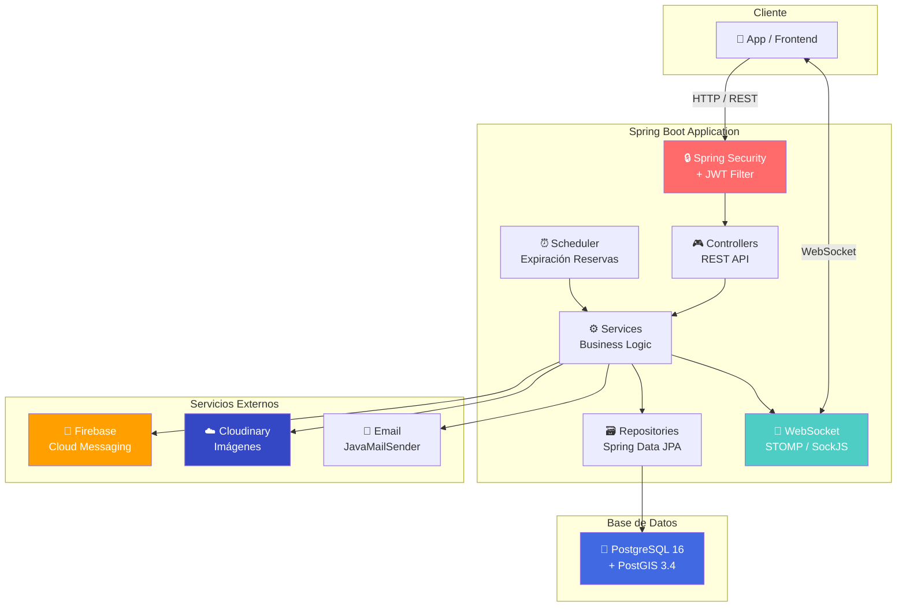

# 🅿️ ParkShare — Marketplace de Estacionamiento On-Demand

---

## 📋 Descripción del Proyecto

Encontrar estacionamiento en Lima es una de las experiencias más frustrantes para cualquier conductor. Las calles del centro, Miraflores, San Isidro y otras zonas de alta demanda sufren de congestión constante, y los conductores pierden en promedio **20-30 minutos** buscando un lugar donde estacionar.

**ParkShare** resuelve este problema creando un **marketplace on-demand** que conecta a propietarios de cocheras privadas (Hosts) con conductores que necesitan estacionamiento (Drivers). La plataforma permite:

- 🔍 **Búsqueda geolocalizada** — Encuentra cocheras cercanas a tu ubicación en tiempo real usando PostGIS.
- 📱 **Reserva instantánea** — Reserva y paga directamente desde la app con billetera virtual.
- 📲 **Check-in/Check-out con QR** — Proceso de entrada y salida automatizado mediante códigos QR.
- 🔔 **Notificaciones push** — Alertas en tiempo real sobre el estado de reservas vía Firebase Cloud Messaging.
- 🔄 **Disponibilidad en tiempo real** — WebSocket (STOMP/SockJS) para actualizaciones instantáneas del estado de cocheras.
- ⭐ **Sistema de reseñas** — Calificaciones bidireccionales entre conductores y propietarios.
- 💰 **Billetera virtual** — Sistema financiero con auditoría completa de transacciones.

---

## 🛠️ Tecnologías Utilizadas

| Categoría | Tecnología | Versión |
|---|---|---|
| **Backend Framework** | Spring Boot | 3.2.5 |
| **Lenguaje** | Java (OpenJDK) | 21 |
| **Base de Datos** | PostgreSQL + PostGIS | 16 + 3.4 |
| **Seguridad** | Spring Security + JWT (JJWT) | 0.11.5 |
| **Tiempo Real** | WebSocket (STOMP / SockJS) | — |
| **Notificaciones Push** | Firebase Cloud Messaging (Admin SDK) | 9.2.0 |
| **Generación QR** | ZXing (Core + JavaSE) | 3.5.2 |
| **Almacenamiento de Imágenes** | Cloudinary | 1.36.0 |
| **Emails Transaccionales** | JavaMailSender + Thymeleaf | — |
| **Documentación API** | SpringDoc OpenAPI (Swagger UI) | 2.5.0 |
| **Contenedorización** | Docker + Docker Compose | — |
| **Testing** | JUnit 5 + TestContainers | 1.19.7 |
| **Utilidades** | Lombok | — |

---

## 🏗️ Arquitectura del Sistema



---

## 📊 Modelo Entidad-Relación


---

## ✅ Requisitos Previos

Asegúrate de tener instalado:

| Herramienta | Versión mínima | Verificar instalación |
|---|---|---|
| **Docker** + Docker Compose | 24.x / 2.x | `docker --version` |
| **Java (JDK)** | 21 | `java -version` |
| **Maven** | 3.9+ | `mvn -version` |
| **Git** | 2.x | `git --version` |

---

## 🚀 Cómo Ejecutar el Proyecto

### Opción 1: Docker Compose (Recomendado)

```bash
# 1. Clonar el repositorio
git clone https://github.com/ChrisMar0512/PROYECTOFINAL_DBP.git
cd PROYECTOFINAL_DBP

# 2. Crear archivo de variables de entorno
cp .env.example .env
# Editar .env con tus valores reales (ver sección Variables de Entorno)

# 3. Levantar todos los servicios
docker compose up --build -d

# 4. Verificar que los contenedores están corriendo
docker compose ps

# 5. Ver logs de la aplicación
docker compose logs -f parkshare_app
```

La aplicación estará disponible en: `http://localhost:8080`

Swagger UI: `http://localhost:8080/swagger-ui/index.html`

### Opción 2: Desarrollo Local (Maven)

```bash
# 1. Levantar solo la base de datos con Docker
docker compose up parkshare_db -d

# 2. Esperar a que PostgreSQL esté listo
docker compose logs -f parkshare_db  # Ctrl+C cuando veas "ready to accept connections"

# 3. Compilar y ejecutar la aplicación
mvn clean install -DskipTests
mvn spring-boot:run
```

### Opción 3: Ejecutar Tests

```bash
# Tests unitarios e integración (usa TestContainers — requiere Docker)
mvn test
```

---

## 🔐 Variables de Entorno

Copia `.env.example` a `.env` y configura los siguientes valores:

| Variable | Descripción | Valor por Defecto |
|---|---|---|
| `POSTGRES_DB` | Nombre de la base de datos PostgreSQL | `parkshare` |
| `POSTGRES_USER` | Usuario de PostgreSQL | `parkshare_user` |
| `POSTGRES_PASSWORD` | Contraseña de PostgreSQL | `parkshare_pass` |
| `POSTGRES_PORT` | Puerto de PostgreSQL | `5432` |
| `SPRING_DATASOURCE_URL` | URL JDBC de conexión a PostgreSQL | `jdbc:postgresql://localhost:5432/parkshare` |
| `SPRING_DATASOURCE_USERNAME` | Usuario de Spring Datasource | `parkshare_user` |
| `SPRING_DATASOURCE_PASSWORD` | Contraseña de Spring Datasource | `parkshare_pass` |
| `APP_JWT_SECRET` | Secreto para firmar tokens JWT (mín. 64 caracteres) | *(cambiar obligatoriamente)* |
| `APP_JWT_EXPIRATION` | Tiempo de expiración del JWT en milisegundos | `86400000` (24 horas) |
| `FIREBASE_CREDENTIALS_PATH` | Ruta al JSON de credenciales de Firebase | `classpath:firebase-service-account.json` |

> **⚠️ Importante:** Nunca subas el archivo `.env` ni las credenciales de Firebase al repositorio.

---

## 📡 Endpoints de la API

Base URL: `/api/v1`

### 🔑 Autenticación (`/api/v1/auth`)

| Método | Endpoint | Descripción | Auth |
|---|---|---|---|
| `POST` | `/api/v1/auth/register` | Registrar nuevo usuario (DRIVER o HOST) | ❌ No |
| `POST` | `/api/v1/auth/login` | Iniciar sesión y obtener JWT | ❌ No |

### 🅿️ Espacios de Estacionamiento (`/api/v1/parking-spaces`)

| Método | Endpoint | Descripción | Auth |
|---|---|---|---|
| `POST` | `/api/v1/parking-spaces` | Crear nueva cochera (multipart: data + photo) | 🔒 HOST |
| `PUT` | `/api/v1/parking-spaces/{id}` | Actualizar cochera existente | 🔒 HOST |
| `PUT` | `/api/v1/parking-spaces/{id}/availability` | Cambiar estado de disponibilidad | 🔒 HOST |
| `GET` | `/api/v1/parking-spaces/mine` | Listar mis cocheras | 🔒 HOST |
| `GET` | `/api/v1/parking-spaces/dashboard` | Dashboard de métricas del host | 🔒 HOST |
| `GET` | `/api/v1/parking-spaces/search?lat=&lng=&radius=` | Buscar cocheras por radio (metros) | 🔒 JWT |
| `POST` | `/api/v1/parking-spaces/{id}/favorites` | Agregar cochera a favoritos | 🔒 DRIVER |
| `DELETE` | `/api/v1/parking-spaces/{id}/favorites` | Quitar cochera de favoritos | 🔒 DRIVER |
| `GET` | `/api/v1/parking-spaces/favorites` | Listar cocheras favoritas | 🔒 DRIVER |

### 📅 Reservaciones (`/api/v1/reservations`)

| Método | Endpoint | Descripción | Auth |
|---|---|---|---|
| `POST` | `/api/v1/reservations` | Crear nueva reserva | 🔒 JWT |
| `GET` | `/api/v1/reservations/my-history` | Historial de reservas del conductor | 🔒 JWT |
| `GET` | `/api/v1/reservations/{id}` | Detalle de una reserva | 🔒 JWT |
| `DELETE` | `/api/v1/reservations/{id}` | Cancelar reserva (solo PENDING) | 🔒 JWT |
| `GET` | `/api/v1/reservations/parking-space/{spaceId}` | Historial de reservas por cochera | 🔒 JWT |

### 💰 Billetera Virtual (`/api/v1/wallet`)

| Método | Endpoint | Descripción | Auth |
|---|---|---|---|
| `GET` | `/api/v1/wallet/balance` | Consultar saldo actual | 🔒 JWT |
| `POST` | `/api/v1/wallet/topup` | Recargar saldo | 🔒 JWT |
| `GET` | `/api/v1/wallet/transactions?page=&size=` | Historial de transacciones (paginado) | 🔒 JWT |
| `GET` | `/api/v1/wallet/transactions/type/{type}` | Transacciones filtradas por tipo | 🔒 JWT |
| `GET` | `/api/v1/wallet/earnings-summary` | Resumen de ganancias | 🔒 HOST |

### 📲 Check-in / Check-out (`/api/v1/checkin`)

| Método | Endpoint | Descripción | Auth |
|---|---|---|---|
| `POST` | `/api/v1/checkin/generate/{reservationId}` | Generar código QR para la reserva | 🔒 JWT |
| `POST` | `/api/v1/checkin/check-in` | Registrar entrada escaneando QR | 🔒 JWT |
| `POST` | `/api/v1/checkin/check-out` | Registrar salida escaneando QR | 🔒 JWT |

### ⭐ Reseñas (`/api/v1/reviews`)

| Método | Endpoint | Descripción | Auth |
|---|---|---|---|
| `POST` | `/api/v1/reviews` | Crear reseña tras reserva completada | 🔒 JWT |
| `GET` | `/api/v1/reviews/parking-space/{id}` | Ver reseñas de una cochera | 🔒 JWT |
| `GET` | `/api/v1/reviews/user/{id}` | Ver reseñas de un usuario | 🔒 JWT |

### 🔄 WebSocket

| Protocolo | Endpoint | Descripción |
|---|---|---|
| STOMP/SockJS | `/ws` | Conexión WebSocket para actualizaciones en tiempo real |
| Subscribe | `/topic/parking-updates` | Canal de actualizaciones de estado de cocheras |

---

## 👥 Equipo de Desarrollo

| Nombre | Rol | Módulo |
|---|---|---|
| *Por definir* | Backend Developer | Autenticación & Seguridad |
| *Por definir* | Backend Developer | Reservaciones & Notificaciones |
| *Por definir* | Backend Developer | Billetera Virtual & Pagos |
| *Por definir* | Backend Developer | Check-in/out & QR |
| *Por definir* | Backend Developer | Reseñas & Búsqueda Geoespacial |

---

## 📜 Licencia

Este proyecto está licenciado bajo la **Licencia MIT**. Consulta el archivo [LICENSE](LICENSE) para más detalles.

```
MIT License

Copyright (c) 2025 ParkShare Team

Permission is hereby granted, free of charge, to any person obtaining a copy
of this software and associated documentation files (the "Software"), to deal
in the Software without restriction, including without limitation the rights
to use, copy, modify, merge, publish, distribute, sublicense, and/or sell
copies of the Software, and to permit persons to whom the Software is
furnished to do so, subject to the following conditions:

The above copyright notice and this permission notice shall be included in all
copies or substantial portions of the Software.

THE SOFTWARE IS PROVIDED "AS IS", WITHOUT WARRANTY OF ANY KIND, EXPRESS OR
IMPLIED, INCLUDING BUT NOT LIMITED TO THE WARRANTIES OF MERCHANTABILITY,
FITNESS FOR A PARTICULAR PURPOSE AND NONINFRINGEMENT. IN NO EVENT SHALL THE
AUTHORS OR COPYRIGHT HOLDERS BE LIABLE FOR ANY CLAIM, DAMAGES OR OTHER
LIABILITY, WHETHER IN AN ACTION OF CONTRACT, TORT OR OTHERWISE, ARISING FROM,
OUT OF OR IN CONNECTION WITH THE SOFTWARE OR THE USE OR OTHER DEALINGS IN THE
SOFTWARE.
```
